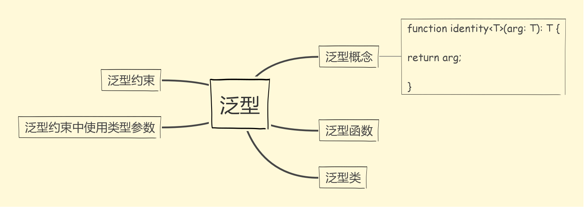
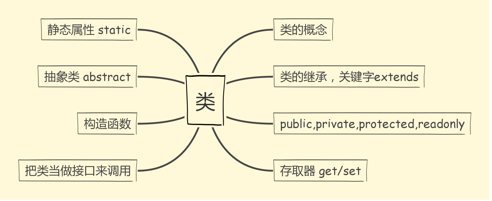

前段时间有朋友和我推荐 `TypeScript` ,他说写起来特别爽，让我去试一试，那时候我还在那是啥高深莫测的东西。刚好那段时间忙，一直没有时间看。最近好像是闲下来了，有功夫来探一探 `TypeScript` ;简单说 `ts` 主要提供的是 `dynamic type check`，提供的 `interface` 接口这个功能在开发项目的时候会很有帮助。`TypeScript `是 `JavaScript` 的一个超集。他和 `JavaScript` 有着千丝万缕的关系。

`TypeScript` 相关命令

```
tsc -init     //ts文件编译成js文件
tsc -w    //实时监控文件编译,即一遍写ts代码保存的时候就可以看到js代码
```
运行了 `tsc -init` 以后会生成一个 `tsconfig.json` 配置文件

# 函数

函数是 `JavaScript` 里面最基本的单位，我首先从函数入手慢慢的去学习更多的 `TypeScript` 语法，进而进一步掌握 `ts`的用法；

需要验证函数参数类型，最基本的包括，`string` 和 `number`，`string[]`,`number[]`,还有元组（ = > 进入元组的学习=>基本类型的学习）
和 `JavaScript` 一样，`TypeScript` 函数可以创建有名字的函数和匿名函数

```
function add(x:number,y:number):number {
  return x + y
}   //有名函数
let myAdd = function(x:number,y:number):number {
  return x + y
}   //匿名函数
```
我们只对代码右侧的匿名函数进行了类型定义，而等号左边的 `myAdd` 是通过赋值操作进行类型推断出来的，书写完整的函数类型。(类型推断:如果没有明确的指定类型，那么 `TypeScript` 会依照类型推论（`Type Inference`）的规则推断出一个类型。)
```
let myAdd: (x:number,y:number) => number = 
function(x: number,y:number):number { return x + y}
```
函数类型包含两部分: 参数类型和返回值类型；在 `TypeScript` 的类型定义中, => 用来表示函数的定义，左边是输入类型，需要用括号括起来，右边是输出类型，和 `ES6` 的箭头函数不一样

## 可选参数和默认参数
`TypeScript` 里的每一个函数参数都是必须的，传递给函数的参数个数必须与函数期望的参数个数一致,否则会报错。
> 必填参数
```
function buildName(firstName:string,lastName:string) {
  return firstName + " " + lastName
}
let result0 = buildName(12, 12);    //提示 12 类型的参数不能赋值给 string
let result1 = buildName('Bob')    //提示应该有两个参数，但是只获得一个
let result2 = buildName('Bob','Adams','"sr')    //提示应该有两个参数，但是只获得三个
let result3 = buildName("Bob", "Adams");    //参数和传入的参数一样，不提示
```
> 可选参数

 实现参数可选功能，我们需要在参数名旁边加 `?`，但是可选参数必须跟在参数后面
```
function selectParam(firstName:string,lastName?:string) {
  return firstName + " " + lastName
}
let selectParam1 = selectParam('bob')
let selectParam2 = selectParam('bob','Adam')
let selectParam2 = selectParam('bob','Adam')    //两个变量无法重新声明
```
> 默认参数

我们可以为参数提供默认值，如果带默认值的参数出现在必须参数前面，用户必须明确的传入 `undefined` 值来获得默认值
```
function param(firstName:string,lastName = 'Smith') {
  return firstName + ' ' + lastName
}
let param1 = param('bob')
let param2 = param('bob','Adam','kk')   //提示参数应该是1-2个
```
> 剩余参数

必要参数，默认参数和可选参数都是表示某一个参数，有时候不知道要操作多少个参数，我们可以用 `...` 来操作剩余参数
```
function restParam (firstName:string,...restOfName:string[]) {
  return firstName + " " + restOfName.join(' ')
}
let employName = restParam ('Joseph',"Samuel","Bob")
//restParam 可以换一种形式
let restParamFun:(fname:string,...rest:string[]) => string = restParam
```
## `this` 和 箭头函数
在 `JavaScript` 里面 `this` 的值在函数被调用的时候指定。但 `TypeScript` 创建时候指定的
```
interface Card {
  suit: string;
  card: number;
}
interface Deck {
  suits: string[];
  cards: number[];
  createCardPicker(this:Deck):()=>Card;
}
let deck:Deck = {
  suits:['hearts','spades','clubs'],
  cards:Array(52),
  createCardPicker:function(this:Deck) {
    return () => {
      let pickedCard = Math.floor(Math.random()*52)
      let pickedSuit = Math.floor(pickedCard / 13);
      return { suit: this.suits[pickedSuit],card:pickedCard % 13}
    }
  }
} 
let cardPicker = deck.createCardPicker();
let pickedCard = cardPicker();
alert("card: " + pickedCard.card + " of " + pickedCard.suit);
```
如果是 `JavaScript` 会报错，此时 `this` 指向了 `window`，但是`TypeScript` 不会报错，他指定了 `this` 会在哪个对象上面调用
# 基本类型


在 `JavaScript` 的类型分为两种：原始数据类型（`Boolean`，`number`，`string`，`null`，`undefined`，`Synmbol`）和对象类型，在 `TypeScript` 中原始类型数据也是使用。为了让程序有价值,我们需要能够处理最简单的数据单元，数字，字符串
> 数字,字符串
```
let decLiteral:number = 6   //数字类型
let name1:string = 'bob'    //字符串类型
let sentence:string = `Hello, my name is ${name1}`    //字符串模板
let list0:number[] = [1,2,3,4]    //[]形式定义数组
let list1:string[]=['12','12','90']
let list2:Array<number> = [1,23,4]    //Array<元素类型>
let list3:Array<string> = ['1','23','4']    //Array<元素类型>
```
> 数组类型
在 `TypeScript` 中数组类型有多重定义方式，比较灵活

>* 类型 + 方括号 表示法
 ```
 let fibonacci:number[] = [1,2,3,4]//只能传number类型的，否则会提示错误
 ```
>* 2.数组泛型 (=> 跳到泛型去学习)
 ```
 let fibinacci: Array<number> = [1,2,3,4]
 ```
>* 3.用接口表示数组 (=> 跳到接口去学习)
 ```
interface NumberArray {
  [index:number]: number
}
let fibonacci: NumberArray = [1,2,3,4]
```
`NumberArray` 表示：只要是 `index` 类型的 `number` ,值类型也一定是 `number`

>* 4.`any` 在数组中的应用

使用 `any` 类型会导致这个函数可以接受任何类型的参数，这样会丢失一些信息；如果我们传入一个数字，我们只知道任何类型的值都有可能被返回 
```
let list:any[] =  ['Xcat Liu', 25, { website: 'http://xcatliu.com' }];
```
> 元组 `Tuple`

元组类型允许表示一个已知元素数量和类型的数组，各元素的类型不必相同(数组合并了相同类型的对象，而元组合并了不同类型的对象)
```
let x:[string,number];
x = ['Hello',10]
```

> 枚举：取值被限定在一定范围内的场景，比如说一周只有七天
```
enum Color { Red,Green,Blue}
let c:Color = Color.Green
```
> `any` 在编程阶段还不清楚类型的变量指定一个类型，值可能是动态输入,但是 `Object` 类型的变量值允许你给她赋任意的值，不能在他的上面调用方法
```
let notSure:any = 4
notSure = "maybe a string instead"
notSure = false  
```
> `void` 类型与 `any` 类型相反，他表示没有任何类型，当有一个函数没有返回
```
function warnUser():void {
  console.log("This is my waring message")
}
```
> `undefined` 和 `null` ,它们的本身的类型用处不是很大：
> `Never`  类型表示的那些永远不存在的值类型
> 断言 `as` 相信我，我知道自己在干什么
```
let someValue:any = "this is a string"
let strLength:number = (<string>someValue).length//“尖括号”语法
let strLength1: number = (someValue as string).length;//一个为as语法
```
> 联合类型：表示取值可以是多种类型中的一种
```
let myFavoriteNumber:string|number;
myFavoriteNumber = 'seven'
myFavoriteNumber = 7
```

# 泛型

在软件工程中，我们不仅要创建一致定义良好的 `API`，同时也要考虑可重用性，组件不仅能够支持当前的数据类型，同时也能支持未来的数据类型，这在创建大型系统时为你提供了十分灵活的功能
用泛型来创建可重用的组件；泛型是一种**特殊的变量，只用于表示类型而不是值**
> 泛型函数
```
function identity<T>(arg:T):T {
  return arg;
}
let output = identity<string>("myString")
```
区别：泛型函数和非泛型函数没有什么不同，只是有一个类型参数在最前面，像函数声明一样
```
let myIdentity:<T>(arg:T) => T = identity
let myIdentity1:{ <T>(arg:T):T} = identity
```
可以使用带有调用签名的对象字面量来定义泛型函数，我们可以将对象字面量拿出来作为一个接口，将一个泛型参数当做整个接口的一个参数，这样我们就能清楚的知道使用的具体是哪个泛型类型
> 泛型接口
```
interface GenericIdentityFn {
  <T>(arg:T):T
}
function identity<T>(arg:T):T {
  return arg
}
let myIdentity:GenericIdentityFn = identity
```
> 泛型类 (=>类的学习)

泛型类看上去和泛型接口差不多，泛型类使用(<>)括起泛型类型，跟在类名后面
```
class GenericNumber<T> {
  zeroValue:T,
  add:(x:T,y:T)=>T
}
let myGenericNumber = new GeneriNumber<number>()
```
类有两个部分：静态部分和实例部分，泛型类指的实例部分，所以静态属性不能使用这个泛型类型，定义接口来描述约束条件
> 泛型约束
```
interface Lengthwise {
  length:number
}
function loggingIdentity<T extends Lengthwise>(arg:T):T {
  console.log(arg.length)
  return arg
}
```
# 接口

`TypeScript` 核心原则之一是对值所具有的结构进行类型检查，它是对行为的抽象，具体行动需要有类去实现，一般接口首字母大写。一般来讲，一个类只能继承来自另一个类。有时候不同类之间可以有一些共有的特性，这时候就可以把特性提取成接口，用 `inplements` 关键字来实现，这个特性大大提高了面向对象的灵活性

可选属性的好处：可能存在的属性进行定义，捕获引用了一个不存在的属性时的错误
>只读属性

 一些对象属性只能在对象刚刚创建的时候修改它的值
 ```
 interface Point {
   readonly x:number;
   readonly y:number;
 }
 ```
 `TypeScript` 具有 `ReadonlyArray<T>` 类型，它与 `Array<T>` 相似只是把所有的可变方法去掉了，确保数组创建后再也不能被修改

 > readonly vs const 

 如果我们要把他当做一个变量就使用 `const` ,若为属性则使用`readonly`

> 额外的属性检查

 1.可以使用类型断言绕过这些检查（断言的两种形式)
 ```
let strLength:number = (<string>someValue).length   //“尖括号”语法
let strLength1: number = (someValue as string).length    //一个为 `as` 语法
```
2.使用索引签，对象赋值给另一个变量，对象字面量会被特殊对待而且会经过 额外属性检查，当将它们赋值给变量或作为参数传递的时候
```
let squareOptions = { colour: "red", width: 100 }
let mySquare = createSquare(squareOptions)
```
3.添加字符串索引签名
```
interface SquareConfig {
  color?:string;
  width?:number;
  [propName:string]:any
}
```
> 函数类型

接口能够描述 `JavaScript` 中对象拥有的各种各样的外形，描述了带有的普通对象之外，接口也可以描述成函数类型;他有一个调用签名，参数列表和返回值类型的函数定义，参数列表里的每一个参数都需要名字和类型，函数的参数名不需要与接口里定义的名字相匹配，如果你没有指定参数类型，`TypeScript` 的类型系统会推断出参数类型 
```
interface SearchFunc {
  (source:string,subString:string):boolean;
}
let MySearch:SearchFunc;
MySearch = function(source:string,subString:string) {
  let result = source.search(subString);
  return result > -1
}
```
> 可索引的类型
```
interface StringArray {
  [index:number]:string
}
//let myArray:StringArray = ["Bob",'Fred']
let myArray:StringArray;
myArray = ["Bob",'Fred']
```
> 类类型的实现接口,使用关键字 `implements`
```
interface ClockInterface {
  currentTime: Date;
}
class Clock implements ClockInterface {
  currentTime:Date;
  constructor(h:number,m:number){}
}
```
> 继承接口 关键字extends
```
interface Shape {
  color:string;
}
interface PenStroke {
  penWidth:number;
}
interface Square extends Shape,PenStroke {
  sideLength:number
}
let square = <Square>{}
```
`extends` 是继承某个类, 继承之后可以使用父类的方法, 也可以重写父类的方法; 

`implements` 是实现多个接口, 接口的方法一般为空的, 必须重写才能使用 

# 类

我们引用的任何一个类成员的时候都用了 `this`,他表示我们访问的是类成员
> 类( `Class` ):定义一件事情的抽象特点，包括他的属性和方法

> 对象( `Object` ):类的实例，通过 `new` 生成

> 面向对象( `OOP` )的三大特性：封装，继承，多态

> 封装( `Encapsulation` ): 将对数据的操作细节隐藏起来，只暴露对外的接口，外界端不需要（也不可能）知道细节，就能通过对外提供的接口访问该对象，同时也保证了外界无法任意改变对象内部数据

> 继承（ `Inheritance` ）：子类继承父类，子类除了拥有父类的所有特性外，还有一些更具体的特性

> 多态（ `Polymorphism`）：由继承而产生了相关的不同类，对同一个方法有不同的响应。比如 `Cat` 和 `Dog` 都继承自 `Animal`，但是分别实现了自己的 `eat` 方法。此时针对某一个实例，我们无需了解它是 `Cat` 还是 `Dog`，就可以直接调用 `eat` 方法，程序会自动判断出来应该如何执行 `eat`

> 存取器（ `getter & setter` ）：用以改变属性的读取和赋值行为

> 修饰器（ `Modifiers` ）：修饰符是一些关键字，用于限定成员或类型的性质

> 抽象类（`Abstract Class`）：抽象类是提供其他类继承的基类，抽象类不允许被实例化，抽象类的抽象方法必须在子类中被实现

> 接口（`Interface`）：不同类之间公有的属性和方法，可以抽象成一个接口，接口可以被类实现（`implements`），一个类只能继承自另一个类，但是可以实现多个接口

```
class Greeter {
  greeting:string;
  constructor(message:string) {
    this.greeting = message
  }
  greet() {
    return "Hello" + this.greeting
  }
}
let greeter = new Greeter("World")
```
`new` 构造 `Greeter` 类的一个实例，调用之前定义的构造函数，创建一个`Greeter` 类型的新对象,执行构造函数初始化他
## 继承
通过继承来扩展现有的类,基类通常被称作超类（`Animal`），派生类常被称作子类（`Dog`）
```
class Animal {
  name: string;
  constructor(theName: string) { this.name = theName; }
  move(distanceInMeters:number = 0) {
    console.log(`Animal moved ${distanceInMeters}`)
  }
}
class Dog extends Animal {
  constructor(name: string) { super(name); }
  bark() {
    console.log("woof woof")
  }
  move(distanceInMeters = 5) {
    super.move(distanceInMeters)
  }
}
const dog = new Dog()
dog.bark()
dog.move(10)
```
派生类包含一个构造函数，他必须调用 `super()` ,他会执行基类函数，在构造器函数里访问 `this` 的属性前，一定要调用 `super()` 。这是 `TypeScript` 强制执行的一条重要规则

## 共有私有与受保护的修饰符
在所有 `TypeScript` 里，成员都默认为 `public`
> 当成员被标记成 `private` 时，他就不能在声明他的外部访问

> `protected` 和 `private` 修饰符行为很类似，但是有一点不同 `protected` 成员在派生类中仍然可以访问。

> `readonly` 关键字将属性设置为只读，只读属性必须在声明或者构造函数里被初始化

`TypeScript` 使用的是结构性类型系统，当我们比较两种不同的类型的时候，如果类型成员是兼容的，我们就认为他们类型是兼容的
## 存取器
`TypeScript` 支持通过 `getters/setters` 来截取对对象成员的访问
```
let passcode = 'secret passcode'
class Employee {
  private _fullName:string;
  get fullName():string {
    return this._fullName
  }
  set fullName(newName:string){
    if (passcode && passcode == "secret passcode") {
      this._fullName = newName
    } else {
      console.log("Error: Unauthorized update of employee!");
    }
  }
}
let employee = new Employee();
employee.fullName = "Bob Smith";
if (employee.fullName) {
    alert(employee.fullName);
}
```
## 静态属性
当属性只存在于类本身上面而不是类实例上，叫做静态成员标识符 `static`

## 抽象类
作为其他派生类的基类使用，他们一般不会直接被实例化，抽象类中的抽象方法不包含具体实现并且必须在派生类中实现。抽象方法的语法和接口方法相似，都只是定义方法签名，但不包括方法体。抽象类可包含成员的实现细节，必须包含 `abstract` 关键字标识和访问修饰符

```
abstract class Animal {
  abstract makeSound():void
  move():void {
    console.log('roaming the earch...')
  }
}
```

## 把类当做接口使用
类定义会创建两个东西：类的实例和一个构造函数，类可以创建类型，所以你能够在允许使用接口的地方使用类
```
class Point {
  x:number;
  y:number;
}
interface Point3d extends Point {
  z:number
}
let point3d:Point3d = {x:1,y:2,z:3}
```
# 内置对象
`JavaScript` 中有很多内置对象，它们可以直接在 `TypeScript` 中当做定义好了的类型
```
let b:Boolean = new Boolean(1)
let c:Error = new Error('Error occurred')
let d:Date = new Date()
let r:RegExp = /[a-z]/
```
`DOM` 和 `BOM` 提供的内置对象，在 `TypeScript` 中会经常用到